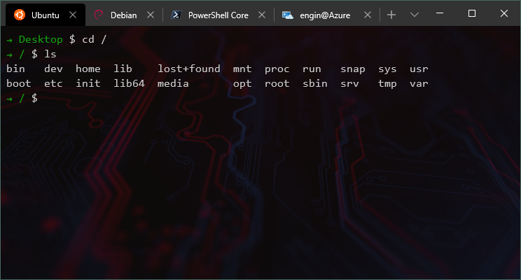

# Bash Scripting Conventions



Here is the opinionated conventions for Bash Scripts

## Bash script file

Use `#!/usr/bin/env bash` instead of `#!/bin/bash`

The former searches the user's _PATH_ to find the bash binary.

The latter assumes it is always installed to `/bin/` folder which can cause issues.

_NOTE: There are times when one may have a good reason for using `#!/bin/bash` or another direct path to the binary_

## Naming variables

All variables should be in _ALLCAPS_ format, it shouldn't have any special character except underscore `( _ )` to improve readability, eg. dash(-), plus(+) etc.

```bash
USER=`echo whoami`
LIST_OF_FILES=`echo ls -la`
```

_Benefit of having this naming convention helps to notice all the variables in a Bash script file at a first glance._

## Bash specific syntaxes

Almost every Linux distro comes with _Bash_ out-of-the-box.

So, it's _almost_ reliable to use _Bash_ specific syntaxes, such as, conditions, loops, etc.

We can use _Bash_ specific syntaxes on _Azure DevOps Pipelines_ for example, because every _Hosted Agents_ comes with _Bash_ installed on it.

But, in case of deploying _Bash_ scripts in a Docker Container, we can't rely on _Bash_.

_Ubuntu_, _CentOS_, _Debian_, etc. Docker images have _Bash_, but more minimal Docker images doesn't, such as, _Alpine_.

Either we build from _Ubuntu_, _CentOS_ or _Debian_ based Docker image (_around 600MB_) with _Bash_, or we can build from _Alpine Docker_ image (_around 6MB_)

Unfortunately, we can't use _Bash_ specific syntaxes on _Alpine Docker_ images, because it's not pre-installed on the image.

## Function declaration and usage

_Always_ avoid using the `function` keyword, it reduces compatibility with older versions of bash.

Use

```bash
do_something() {
}
```

Instead of

```bash
function do_something() {
}
```

All the scripts should developed in _DRY_ principle, so if part of the script can be reused in somewhere else, it should be extracted as a function and called in multiple places.

```bash
doit() {

}

echo DoIt now
doit
echo DoIt again
doit
```

In _Bash_, you can't call a function which is not declared yet, so, just in case, all the functions should be placed on top of the script files.

In _Bash_, you can write function definition and body in single line, but it should be avoided because of viewing all the lines at a glance.

If you need to return a value from a _Bash_ function, do it at the very bottom line of the function.

According to _Bash_ language documentation, we can only return single numerical value from a function.

```bash
sum() {
    return $1 + $2
}

RESULT=sum 1 3
```

Most of the cases it's not enough to return only one value out from the function.

In that cases, echo a JSON payload to the console only at 1 point in the function and consume it at the caller site.

```bash
sum() {
    echo `{ "sum": $1 + $2, "avg": (($1 + $2)/2) }`
}

RESULT=`echo sum 1 3`
```

Afterwards, we can use [jq](https://stedolan.github.io/jq/) shell extension to parse JSON payload

```bash
SUM=$RESULT | jq '.sum'
AVG=$RESULT | jq '.avg'
```

Since `exit` keyword terminates the script execution, it's best to use `return` instead of `exit`

Prefer local variables within functions over global variables, so always declare variables in a function with `local` keyword

```bash
sum() {
    local SUM=$1 + $2
    return $SUM
}
```

## Parameters

If a _Bash_ script requires parameters to run, always check if those parameters are set.

```bash
if [ -n "$1" ]; then
    # use first parameter
else
    echo "First parameter cannot be blank"
    return 10
fi
```

In some cases we need to check if all the parameters are set, in those cases we can check the number of the parameters by using `$#` syntax

```bash
NUMBEROFPARAMETERS=$#
```

If we need to iterate over parameters, we can use `$@` syntax

```bash
for var in "$@"; do
    echo "current parameter $var"
done
```

## Calling native commands

In Linux world, almost every parameter of native commands has abbreviations, it's good to avoid using abbreviations.

```bash
#use
rm --recursive --force

#instead of
rm -rf
```

## Parallel execution

This will run the given command and keep it running, even after the terminal or SSH connection is terminated. All output is ignored.

```bash
(nohup "$@" &>/dev/null &)
```

## Debugging

_Use [ShellCheck](https://www.shellcheck.net/) tool to find bugs in shell script_

To perform a syntax check and dry run of your bash script, use `-n` argument:

```bash
bash -n myscript.sh
```

To produce a trace of every command executed, use `-v` argument:

```bash
bash -v myscripts.sh
```

To produce a trace of the command, use `-x` argument:

```bash
bash -x myscript.sh
```

`-v` and `-x` can also be made permanent by adding `set -o verbose` and `set -o xtrace` to the script prolog. This might be useful if the script is run on a remote machine, e.g. a build-bot and you are logging the output for remote inspection.

## References

[Shell Style Guide](https://google.github.io/styleguide/shell.xml)

[The Bash Guide](http://guide.bash.academy/)

[Advanced Bash-Scripting Guide](http://www.tldp.org/LDP/abs/html/)

[Bash Reference Manual](https://www.gnu.org/software/bash/manual/bashref.html)

[Evolution of shells in Linux](https://www.ibm.com/developerworks/library/l-linux-shells/)

[Pure Bash Bible](https://github.com/dylanaraps/pure-bash-bible)
