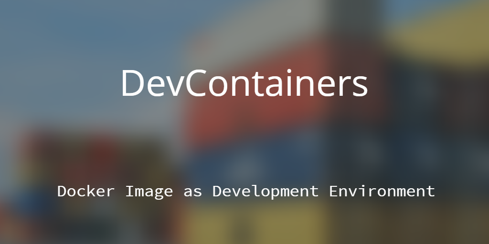

# DevContainers



[Visual Studio Code](https://code.visualstudio.com/) (_as of from version 1.35_) introduced an exciting set of extensions for _remote development_. I highly recommend to install [Remote Development](https://marketplace.visualstudio.com/items?itemName=ms-vscode-remote.vscode-remote-extensionpack) extension pack, it'll install below extensions for you;

* [Remote - Containers](https://aka.ms/vscode-remote/download/containers) : Work with a sandboxed toolchain or container-based application by opening any folder mounted into or inside a container.

* [Remote - SSH](https://aka.ms/vscode-remote/download/ssh) : Work with source code in any location by opening folders on a remote machine/VM using SSH. Supports *x86_64*, _ARMv8l_ (_AArch64_) and _ARMv7l_ (_AArch32_) _glibc-based_ Linux hosts.

* [Remote - WSL](https://aka.ms/vscode-remote/download/wsl) : Get a Linux-powered development experience from the comfort of Windows by opening any folder in the [Windows Subsystem for Linux](https://docs.microsoft.com/en-us/windows/wsl/about).

## System Requirements

It only neededs to have [Docker](https://hub.docker.com/?overlay=onboarding) , [Visual Studio Code](https://code.visualstudio.com/) and [Remote Development](https://marketplace.visualstudio.com/items?itemName=ms-vscode-remote.vscode-remote-extensionpack) extension pack, on the machine.

## Purpose

Setting up a development environment for a project sometimes can be a _lengthy_ and _complex_ process. Especially if you're working on a couple of projects at the same time, some of the requirements for a project may conflict with the requirements of the other project.

Plus, you need to install a combination of every _tool_, every _library_, every _extension_, every _SDK_ required for all the projects on your machine.

Also, you may want to change [Visual Studio Code](https://code.visualstudio.com/) settings per project, because every project requires different settings.

For example, in one of the projects you may need, _Node v11_, _Java v8_, _Maven_ as package manager, couple of settings for [Visual Studio Code](https://code.visualstudio.com/), set of extensions in [Visual Studio Code](https://code.visualstudio.com/). But, you may need, _Node v13_, _Python v3.7_, _pip_ as package manager, _.Net Core 3.1_, couple of different settings for [Visual Studio Code](https://code.visualstudio.com/), another set of extensions in [Visual Studio Code](https://code.visualstudio.com/), etc.

Other than those, you may need, [PowerShell](https://docs.microsoft.com/en-us/powershell/) for one of the projects and [Bash](https://www.gnu.org/software/bash/) for another project. You may need, a couple of libraries installed on your machine for a project, but not for every project.

If we want to extend the requirements, we may add, [Ruby](https://www.ruby-lang.org/en/), [PHP](https://www.php.net/), [Redis](https://redis.io/), [Terraform](https://www.terraform.io/), [Kubernetes](https://kubernetes.io/), [Helm](https://helm.sh/), etc. as requirements for projects.

Over time, our development machine has almost every kind of _tools_, _SDKs_, _extensions_, _libraries_ installed on it, and getting slower and slower.

We may end-up with configuration conflicts, version conflicts, etc. and those conflicts are the hardest to find and sometimes to fix.

Setting up a machine for a project (especially if the project is relatively big/complex one) is hard, keeping setup instructions is also hard to keep up-to-date.

Onboarding a new team member sometimes requires more than 1 day to make sure that he/she is having the exact same tools with the exact same versions on his/her machine.

This is another problematic area, conflicts between team members' machines.

To overcome this problem, we may have a clean development machine, with only [Docker](https://www.docker.com/), [Visual Studio Code](https://code.visualstudio.com/) and [Remote Development](https://marketplace.visualstudio.com/items?itemName=ms-vscode-remote.vscode-remote-extensionpack) extension pack.

Basically, we're using a `Dockerfile` to define our development environment for a project and develop the project inside of this development environment. So, every team member spends only a couple of minutes to build the _Docker Image_ on his/her machine. After that, we can make sure that every team member has the exact same version of every tool with the exact same versions.

## Getting started

Open a project folder with Visual Studio Code, create `.devcontainer` folder at the root of the project. Create `devcontainer.json` and `Dockerfile` files in the `.devcontainer` folder.

Basically, `devcontainer.json` file is for configuring Visual Studio Code for the project, and `Dockerfile` file is for building the actual development environment with Docker.

Building a _Docker Image_ for _RunTime_ of the project and _DevelopmentTime_ of the project is two different things.

If you're building a _Docker Image_ for the RunTime of the project, you most probably want to make it simpler, smaller, etc. Because _Docker Image_ is related to the performance of the project. You may start one of the smallest, fastest base images, such as, Alpine, etc.

But, if you're building a _Docker Image_ for the DevelopmentTime of the project, you may want to have _all_ of the tools, libraries installed on the image, so you can have a comfortable development experience. You must consider to start one of the common base images, such as, Ubuntu, Debian, etc.

### Configuring Visual Studio Code

Open `devcontainer.json` file, add following structure into it;

```json
{
  "name": "Project Development Environment",
  "dockerFile": "Dockerfile",
  "runArgs": [
    "-v", "/var/run/docker.sock:/var/run/docker.sock"
  ],
  "settings": {
    "terminal.integrated.shell.linux": "/bin/bash",
    "workbench.iconTheme": "vscode-icons"
  },
  "extensions": [
    "ms-azuretools.vscode-docker",
    "ms-vsliveshare.vsliveshare",
    "vscode-icons-team.vscode-icons",
    "editorconfig.editorconfig"
  ]
}
```

`name` node is for configuring the friendly display name for the dev container.

`Dockerfile` node is for configuring the name of the _Dockerfile_ which will be used to build the _Docker Image_.

`runArgs` node is for passing some parameters to underlying _Docker Image_, aka _DevContainer_. In this example, we're binding host `docker.sock` file to `docker.sock` file in the _DevContainer_, so we can use [Docker CLI](https://docs.docker.com/engine/reference/commandline/cli/) from within the _DevContainer_, but actually, it runs the command on the host machine.

`settings` node is for changing the [Visual Studio Code](https://code.visualstudio.com/) settings only for the opened project. Such as, changing the Terminal shell, changing the Icon Theme, etc.

`extensions` node is for installing extensions for [Visual Studio Code](https://code.visualstudio.com/), only for the opened project. Such as, [Docker](https://marketplace.visualstudio.com/items?itemName=ms-azuretools.vscode-docker), [Live Share](https://marketplace.visualstudio.com/items?itemName=ms-vsliveshare.vsliveshare), [VS Code Icons Theme](https://marketplace.visualstudio.com/items?itemName=vscode-icons-team.vscode-icons), [EditorConfig](https://marketplace.visualstudio.com/items?itemName=editorconfig.editorconfig), etc.

Other than the above nodes, we may include following nodes as-well;

`appPort` node is for exposing ports from _DevContainer_ to host machine. This is useful if you want to access a port from _DevContainer_ from the host machine. In the following example, it binds port _3000_ from _DevContainer_ to port _3000_ on the host machine.

```json
"appPort": 3000:3000
```

`postCreateCommand` node is for running commands after the container has been created. In the following example, it's installing npm packages after _DevContainer_ created.

```json
"postCreateCommand": "npm install"
```

You can find other available properties in the full [devcontainer.json reference](https://code.visualstudio.com/docs/remote/containers#_devcontainerjson-reference)

### Configuring Docker Image

You can use an official _Docker Image_ regarding to the project's main architecture, such as, [.Net Core SDK Image](https://hub.docker.com/_/microsoft-dotnet-core-sdk), [Node Image](https://hub.docker.com/_/node/), [Python Image](https://hub.docker.com/_/python/), [PHP Image](https://hub.docker.com/_/php/), [TensorFlow Image](https://hub.docker.com/r/tensorflow/tensorflow/), etc.

Or you can start with one of the base images which is used heavily by developers, such as, [Ubuntu Image](https://hub.docker.com/_/ubuntu/), [Debian Image](https://hub.docker.com/_/debian/), etc.

You may want to add additional _layers_ to the base image by calling `RUN` commands in the `Dockerfile`, for example;

_Adding .Net Core 3.1 to the base image_:

```bash
RUN curl -SL --output dotnet.tar.gz https://dotnetcli.azureedge.net/dotnet/Sdk/3.1.100/dotnet-sdk-3.1.100-linux-x64.tar.gz \
&& mkdir -p /usr/share/dotnet \
&& tar -ozxf dotnet.tar.gz -C /usr/share/dotnet \
&& rm dotnet.tar.gz \
&& ln -s /usr/share/dotnet/dotnet /usr/bin/dotnet
```

_Adding kubectl to the base image_:

```bash
RUN curl -sL https://packages.cloud.google.com/apt/doc/apt-key.gpg | apt-key add - \
&& echo "deb https://apt.kubernetes.io/ kubernetes-xenial main" | tee -a /etc/apt/sources.list.d/kubernetes.list \
&& apt-get update \
&& apt-get install -y kubectl
```

_Adding Azure CLI to the base image_:

```bash
RUN curl -sL https://aka.ms/InstallAzureCLIDeb | bash
```

_Adding Terraform to the base image_:

```bash
RUN CURR_VER=$(curl -s https://checkpoint-api.hashicorp.com/v1/check/terraform | jq -r -M '.current_version') \
&& wget https://releases.hashicorp.com/terraform/${CURR_VER}/terraform_${CURR_VER}_linux_amd64.zip \
&& unzip terraform_${CURR_VER}_linux_amd64.zip -d /usr/local/bin/ \
&& rm -rf terraform_${CURR_VER}_linux_amd64.zip
```

_Adding Helm CLI to the base image_:

```bash
RUN curl -sL https://git.io/get_helm.sh | bash
```

At the end of the _Dockerfile_ `CMD` command provides the default to execute in the container, for example, in the following example, _DevContainer_ will use [Bash](https://www.gnu.org/software/bash/) as entrypoint.

```bash
CMD ["bash"]
```

We can install [ZSH](https://github.com/ohmyzsh/ohmyzsh) into the _DevContainer_ and set it as entrypoint as-well;

```bash
RUN wget https://github.com/robbyrussell/oh-my-zsh/raw/master/tools/install.sh -O - | zsh || true

CMD [ "zsh" ]
```

### Sharing Git Credentials

[Remote - Containers](https://aka.ms/vscode-remote/download/containers) extension provides out of box support for using local git credentials from inside a container.

If you don't have user name or email address set up locally, you may be prompted to configure it in the _DevContainer_. You can configure username and email address on your local machine by running the following commands;

```bash
git config --global user.name "{USER_NAME}"
git config --global user.email "{EMAIL_ADDRESS}"
```

## Opening a Git Repository in DevContainer (AdHoc way)

Open a clean [Visual Studio Code](https://code.visualstudio.com/) instance, hit `F1` and type '_Open Repository in Container..._'

When [Visual Studio Code](https://code.visualstudio.com/) asks, enter the following information;

* Address of the repository (for example, `polatengin/project-standards` to open this repository in a _DevContainer_)
* VolumeName of the Docker Container
* Name of the folder to clone the repository into the Docker Container

After a couple of minutes, [Visual Studio Code](https://code.visualstudio.com/) should be ready, you should be able to see the files from the cloned repository, also, all the extensions should be installed.

## Sample Projects with DevContainer Configured

* [.NET Core Sample](https://github.com/Microsoft/vscode-remote-try-dotnetcore)
* [Node Sample](https://github.com/Microsoft/vscode-remote-try-node)
* [Python Sample](https://github.com/Microsoft/vscode-remote-try-python)
* [Go Sample](https://github.com/Microsoft/vscode-remote-try-go)
* [Java Sample](https://github.com/Microsoft/vscode-remote-try-java)
* [Rust Sample](https://github.com/microsoft/vscode-remote-try-rust)
* [C++ Sample](https://github.com/microsoft/vscode-remote-try-cpp)
* [PHP Sample](https://github.com/microsoft/vscode-remote-try-php)

## Remote DevContainers

It's required to have more power than we have on our computers in some of the projects, such as, a powerfull GPU for Machine Learning workloads, more RAM for text processing workloads, more CPU for encryption/decryption workloads, etc.

You may have missing some of the hardware requirements as-well, such as, GPU, ARM CPU, etc.

Visual Studio Code and DevContainers extension supports DevContainers running on a remote machine and may leverage hardware resources on remote host.

### Guideline for Remote DevContainers

1. Create an _Ubuntu 18.09_ VM on [Azure Portal](https://portal.azure.com)

2. _[Optional]_ Configure VM to assign DNS Name

3. Connect VM via SSH

```bash
ssh user@<ip-address-or-hostname>
```

4. On the Remote VM, execute following command

```bash
# Update Software Repositories
sudo apt-get update

# Install Docker
sudo apt install docker.io

# Start Docker
sudo systemctl start docker

# Automate Docker
sudo systemctl enable docker
```

5. Enable [Remote API for Docker](https://success.docker.com/article/how-do-i-enable-the-remote-api-for-dockerd) by executing following command on Terminal

```bash
# Create missing folder
mkdir /etc/systemd/system/docker.service.d/

# Change directory to the correct folder
cd /etc/systemd/system/docker.service.d/

# Create configuration file
touch startup_options.conf

# Insert configuration into the configuration file
printf '# /etc/systemd/system/docker.service.d/override.conf\n[Service]\nExecStart=\nExecStart=/usr/bin/dockerd -H fd:// -H tcp://0.0.0.0:2376'\n | sudo tee startup_options.conf

# Reload the unit files
sudo systemctl daemon-reload

# Restart the docker daemon with new startup options
sudo systemctl restart docker.service
```

6. _[Optional]_ To test if _Remote API for Docker_ has been successfully enabled, run following command on Terminal, you should get empty list `[]` as result

```bash
curl http://localhost:2376/images/json
```

7. Create an SSH tunnel by executing following command

```bash
ssh -NL localhost:9997:localhost:2376 user@<ip-address-or-hostname>
```

8. Create an environment variable named `DOCKER_HOST` pointing to the tunnel

```bash
setx DOCKER_HOST tcp://localhost:9997
```

9. _[Optional]_ To test if the SSH tunnel is working, open a new Terminal and execute following command to verify that the returned message does not contain errors

```bash
docker version
```

## Summary

Using [Remote Development](https://marketplace.visualstudio.com/items?itemName=ms-vscode-remote.vscode-remote-extensionpack) extension pack helps to keep development machine clean, also it helps to onboard new people to the project easier.

_DevContainer_ also allows all contributors to work on the project in a standardized environment.

Contributors require less time and guidance to configure their machine for the project, and configuration of the machine causes fewer issues.

## References

[Developing inside a Container](https://code.visualstudio.com/docs/remote/containers)

[VS Code Remote Development Container Definitions](https://github.com/microsoft/vscode-dev-containers)

[Remote Development Extension Pack](https://marketplace.visualstudio.com/items?itemName=ms-vscode-remote.vscode-remote-extensionpack)

[devcontainer.json File Reference](https://code.visualstudio.com/docs/remote/containers#_devcontainerjson-reference)

[Dockerfile Reference](https://docs.docker.com/engine/reference/builder/)
