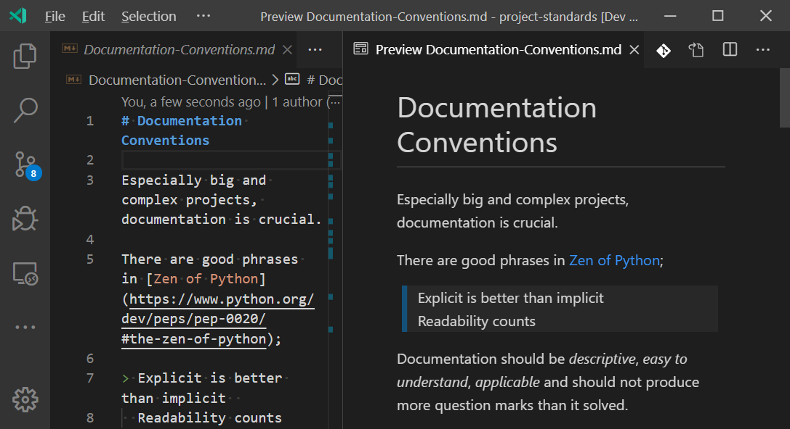

# Documentation Conventions



Especially big and complex projects, documentation is crucial.

There are good phrases in [Zen of Python](https://www.python.org/dev/peps/pep-0020/#the-zen-of-python);

> Explicit is better than implicit  
  Readability counts

Documentation should be _descriptive_, _easy to understand_, _applicable_ and should not produce more question marks than it solved.

Since good documentation is important, there should be some _guideline_ or _check-list_ to make sure that the documentation is good 😀

Here is an opinionated _check-list_ for good documentation;

* Documentation should be in a universal format, such as, _Markdown_, _Microsoft Word_, _Microsoft Powerpoint_, etc.

* If it's possible, documentation should be in _Markdown_ format.

* If it's possible, use [Visual Studio Code](https://code.visualstudio.com/) to create documentation.

* Use [Markdown Lint](https://marketplace.visualstudio.com/items?itemName=DavidAnson.vscode-markdownlint) extension on [Visual Studio Code](https://code.visualstudio.com/) to check _Markdown_ errors before saving the document.

* If you're using _Markdown_, always use _Markdown_ syntax, don't mix it with _HTML_ or other syntaxes.

* Always start with biggest heading (single `#` in _Markdown_).

* Use smaller headings after the _Main Headline_ (biggest heading).

* Use headings to create a _Table of Contents_.

* Use [Markdown TOC](https://marketplace.visualstudio.com/items?itemName=AlanWalk.markdown-toc) extension time-to-time to check if the headings are in correct size or not.

* Always add a description right after headings, don't continue with a list or another heading.

* Use emphasis' to draw attention on part of the sentence and make it more visible.

* If it's possible, use screenshots or animated screenshots (a.k.a _gif_) to explain the section visually.

* If you share a code part, always put it between triple-ticks (```)

* After the first triple-ticks, put the language of the code you're sharing, for example, ```bash.

* Don't use _here_ to create an external reference, use the name of the external reference document, for example, instead of (_You can see the reference in [here](https://github.com/polatengin/project-standards)_) , use (_You can see the reference in [Project Standards](https://github.com/polatengin/project-standards)_).

* Always follow chronological order to create a good documentation. Don't jump between later and prior in time.

* Always read your own documentation before publish it, if it's possible, ask someone else to read it for you and make suggestions to you.

* Always add a _References_ section at the end.
